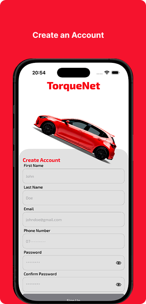
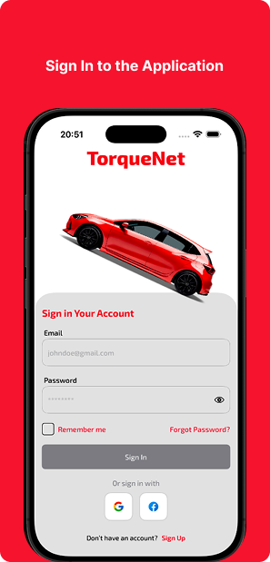
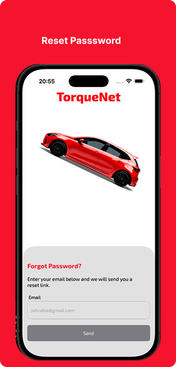
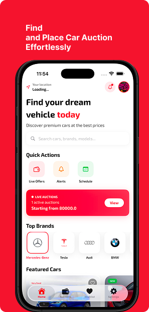
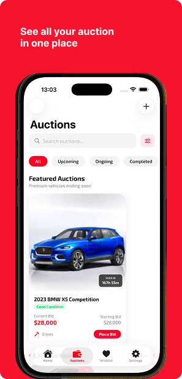
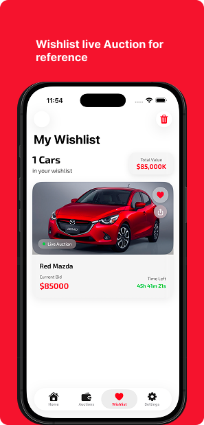
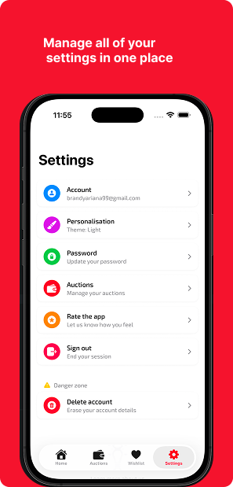

# Torquenet App
TorqueNet Auctions is a modern mobile platform that allows users to discover, bid on, and manage vehicle auctions in real time. The app provides a seamless auction experience where users can explore featured cars, view detailed vehicle specifications, track live bids, and place competitive bids directly from their mobile devices.

The platform supports multiple auction states such as upcoming, live, completed, and featured auctions, allowing users to easily browse and filter vehicles based on their auction status. Each vehicle listing includes comprehensive details such as specifications, images, vehicle history, inspection reports, and bid history.

Users can also save vehicles to their wishlist, track auctions they are interested in, and receive updates on bidding activity. Sellers are able to upload vehicles for auction, manage listings, and monitor bidding progress through a structured auction workflow.

Built with SwiftUI and Firebase, the application leverages real-time data synchronization to ensure bids and auction updates are reflected instantly across users.

Key Features
- Browse featured, upcoming, and live car auctions
- View detailed vehicle information and inspection reports
- Real-time bidding system
- Track recent bids and highest bids
- Save vehicles to a wishlist
- Upload vehicles for auction
- Filter and search auctions by status
- Secure user authentication and profile management

## Structural design pattern
The app follows the Model-View-ViewModel (MVVM) pattern, enhanced with principles from Clean Architecture to ensure better separation of concerns and maintainability.
- Models hold the core data and business logic. These are typically lightweight structs or simple classes.
- Views handle the UI layer and display visual elements using SwiftUI.
- ViewModels serve as the bridge between views and models, transforming raw data into view-ready formats. They're implemented as classes to support state observation and reference passing.

By combining MVVM with clean architecture layers (such as Use Cases, Repositories, and Services), the codebase stays modular, testable, and easy to scale as the app grows.

### Auth Screen
  

### Home Screen
 

### Auction Screen
   

### Wishlist Screen

### Settings Screen

## 🛠️ Tech Stack

- [**Swift**](https://developer.apple.com/swift/)  
  Swift is a powerful and intuitive programming language developed by Apple for building applications across iOS, macOS, watchOS, and tvOS. It is designed to be fast, safe, and modern, helping developers write reliable and maintainable code.

- [**SwiftUI**](https://developer.apple.com/xcode/swiftui/)  
  SwiftUI is Apple’s declarative UI framework used to build user interfaces across all Apple platforms. It enables faster development with live previews, reusable components, and seamless integration with Swift.

- [**Core Data**](https://developer.apple.com/documentation/coredata) Core Data is Apple’s framework for managing the model layer of applications. It provides powerful tools for object graph management and persistence, allowing developers to store and query data efficiently on-device.  

- [**Firebase Firestore**](https://firebase.google.com/docs/firestore)  
  Cloud Firestore is a flexible, scalable NoSQL cloud database from Firebase used to store and sync data in real time. In this app, it manages auctions, bids, vehicles, and user-generated data while keeping information synchronized across devices.

- [**Firebase Authentication**](https://firebase.google.com/docs/auth)  
  Firebase Authentication provides secure user authentication services including email/password and other authentication methods. It is used in this app to manage user accounts, login, registration, and secure access to auction features.

- [**Clean Architecture**](https://www.geeksforgeeks.org/system-design/complete-guide-to-clean-architecture/)  
  Clean Architecture organizes the codebase into independent layers such as presentation, domain, and data. This separation improves scalability, maintainability, and testability by enforcing clear boundaries between business logic and UI components.

- [**Navigation in SwiftUI**](https://developer.apple.com/documentation/swiftui/navigationstack)  
  Navigation in SwiftUI is handled declaratively using `NavigationStack`, `NavigationPath`, and `NavigationLink`. These tools simplify screen transitions and allow the app to manage complex navigation flows in a structured and predictable way.

- [**Core Location**](https://developer.apple.com/documentation/corelocation)  
  Core Location enables access to device location services. Using `CLLocationManager`, apps can request permission, retrieve location updates, and build features that depend on geographic information.

- [**Swift Concurrency (Async/Await)**](https://developer.apple.com/documentation/swift/concurrency)  
  Swift’s modern concurrency model using `async/await` simplifies asynchronous programming. It allows network calls, database operations, and background tasks to run efficiently while keeping the code readable and easier to maintain.

- [**App Theming in SwiftUI**](https://developer.apple.com/documentation/swiftui/environmentvalues/colorscheme)  
  App theming in SwiftUI allows dynamic styling based on system settings or user preferences. The app supports light and dark mode using `@Environment(\.colorScheme)` and a shared theme configuration to maintain a consistent UI across screens.

## Setup Requirements
- IOS device or Simulator
- XCode Editor

## Getting Started
In order to get the app running yourself, you need to:

1.  Clone this project
2.  Import the project into XCode
3.  Get googleService info from firebase setup and add it to the codebase.
4.  Connect your IOS device with USB or just start your Simulator
5.  After the project has finished setting up it stuffs, click the run button

## Support
- Found this project useful ❤️? Support by clicking the ⭐️ button on the upper right of this page. ✌️
- Notice anything else missing? File an issue
- Feel free to contribute in any way to the project from typos in docs to code review are all welcome.
